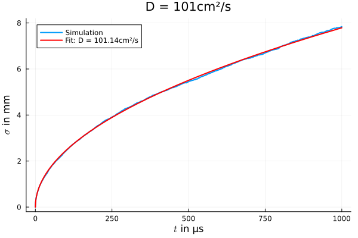
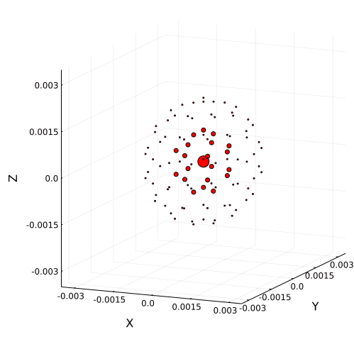

# Charge Drift

Charged particles in vacuum move along the electric field lines under Coulomb's force, $\vec{F} = q \vec{E}$, where $\vec{F}$ corresponds to the force experienced by the particle, $q$ is the charge of the particle and $\vec{E}$ is the electric field. Charged particles in vacuum would be continuously accelerated until approaching the speed of light (called ballistic transport). However, inside a material, scattering prevents this constant acceleration and leads to a constant drift velocity 

```math
v_{d} = \mu E,
```
where $v_{d}$ is the drift velocity, $\mu$ the mobility and $E$ the electric field strength.

The scattering with matter not only limits the absolute drift velocity, it might also deviate the trajectories from the electric field lines: e.g., in crystals, the principal axes orientation has an impact on the resulting drift trajectory. The influence of the scattering on the drift trajectories can be expressed by a 3x3 tensor, the so-called mobility tensor $\mu_{ij}$, which transforms the electric field, $E$, into the drift velocity, $v_{i}$:

```math
v_{i} =  \mu_{ij} \cdot E_{j}.
```

The mobility varies for different materials and depends also on other parameters such as temperature, impurity density and the electric field strength, as explained later.

## Charge Drift Models

Electrons and holes have different mobilities, resulting in different drift velocities. There are several models for the mobility tensor of electrons and holes in certain materials. Right now, two models are implemented. The first one is a pseudo-drift model, the [`ElectricFieldChargeDriftModel`](@ref), which just takes the electric field vectors as drift vectors, see section [Electric Field Charge Drift Model](@ref). The second one, [`ADLChargeDriftModel`](@ref), is a drift model for high purity germanium, see section [ADL Charge Drift Model](@ref). However, the implementation of an own model is possible and explained in section [Custom Charge Drift Model](@ref).

### Electric Field Charge Drift Model

The [`ElectricFieldChargeDriftModel`](@ref) describes a system in which electrons and holes move along the electric field lines. In this case, the mobility is a scalar $\pm$ 1 m²/(Vs) ($+$ for holes, and $-$ for electrons), and thus, the velocity field has the same (or opposite) direction as the electric field. Even though this model does not describe reality, it is useful in some cases to use the electric field vectors as velocity vectors.

In order to set the `ElectricFieldChargeDriftModel` for the simulation, the precision type of the calculation `T` (`Float32` or `Float64`) has to be given as an argument. Note that `T` has to be of the same precision type of the simulation:

```julia
T = SolidStateDetectors.get_precision_type(sim) # e.g. Float32
charge_drift_model = ElectricFieldChargeDriftModel(T)
sim.detector = SolidStateDetector(sim.detector, charge_drift_model)
```

If no charge drift model is specified for the semiconductor of the detector in the configuration files, the default is `ElectricFieldChargeDriftModel`.


### ADL Charge Drift Model

In high-purity germanium, the mobility cannot be expressed by a simple scalar quantity. Germanium has a cubic diamond lattice structure with $\langle$100$\rangle$, $\langle$110$\rangle$ and $\langle$111$\rangle$ as principal directions. Along these axes, the charge drift is parallel to the electric field. However, the longitudinal drift velocity, $v_{l}$, is not equally fast on the three axes. 

On each axes, $v_{l}$ can be described through the parametrization proposed by [D.M. Caughey and R.E. Thomas](https://ieeexplore.ieee.org/document/1448053), which was later expanded by [L. Mihailescu et al.](https://www.sciencedirect.com/science/article/pii/S0168900299012863):

```math
v_l = \frac{\mu_0 E}{(1 + (E/E_0 )^{\beta})^{1/ \beta}} - \mu_{n} E.
```

The parameters $\mu_{0}$, $E_{0}$ and $\beta$ differ for electrons and holes, and $\mu_{n}$ is only relevant for electrons. These parameters were obtained by [B. Bruyneel et al.](https://www.sciencedirect.com/science/article/pii/S0168900206015166) by measuring the drift velocities of electrons and holes in the $\langle$100$\rangle$ and $\langle$111$\rangle$ directions in high purity germanium at a temperature of 78 K. These parameters are stored in a configuration file, "drift\_velocity\_config.yaml", located in `<package_directory>/example/example_config_files/ADLChargeDriftModel`. The configuration file is expressed as following:


```yaml
model: ADLChargeDriftModel
phi110: -45°
material: HPGe
drift:
  velocity:
    model: Bruyneel2006
    parameters:
      e100:
        mu0: 38609cm^2/(V*s)
        beta: 0.805
        E0: 511V/cm
        mun: -171cm^2/(V*s)
      e111:
        mu0: 38536cm^2/(V*s)
        beta: 0.641
        E0: 538V/cm
        mun: 510cm^2/(V*s)
      h100:
        mu0: 61824cm^2/(V*s)
        beta: 0.942
        E0: 185V/cm
      h111:
        mu0: 61215cm^2/(V*s)
        beta: 0.662
        E0: 182V/cm
```

where the parameters are stored under the keys `e100`, `e111`, `h100` and `h111`, in which `e` and `h` stand for electrons and holes, respectively, and `100` and `111`, for the principal axes $\langle$100$\rangle$ and $\langle$111$\rangle$. 
By default, in `SolidStateDetectors.jl` the $\langle$001$\rangle$ axis is aligned with the Z-axis of the coordinate system of the simulation. The crystal orientation can be set through the `phi110` parameter, where the $\langle$001$\rangle$ axis is still aligned with the Z-axis and the angle between the $\langle$110$\rangle$ principal direction of the crystal and the X-axis is given by `phi110`. Alternatively, the crystal orientation can be set by passing a rotation matrix that describes the rotation from the global coordinate system to the crystal orientation system.


If the electric field is not aligned with any of the crystal axes, the charge drift velocity is not necessarily aligned with the electric field. In the [`ADLChargeDriftModel`](@ref), two models are implemented to describe the charge drift of electrons and holes between the axes. Detailed information about the charge drift models is provided in the papers from [L. Mihailescu et al. ](https://www.sciencedirect.com/science/article/pii/S0168900299012863) for electrons and from [B.Bruyneel et al.](https://www.sciencedirect.com/science/article/pii/S0168900206015166) for holes. Find the detailed calculations and modifications from the publications as implemented in SolidStateDetectors.jl [here](../assets/ADLChargeDriftModel.pdf).


In order to perform the calculation of the drift velocities, a configuration file containing the parametrization values like the "drift\_velocity\_config.yaml" (with Bruyneel's data or modified values), has to be passed as an argument to the `ADLChargeDriftModel` function. The precision of the the calculation `T` (`Float32` or `Float64`) has to be given as a keyword `T`. Note that `T` has to be of the same type as the chosen in the simulation:

```julia
T = SolidStateDetectors.get_precision_type(sim) # e.g. Float32
charge_drift_model = ADLChargeDriftModel("<path_to_ADL_configuration_file>", T=T)
sim.detector = SolidStateDetector(sim.detector, charge_drift_model)
```

The `ÀDLChargeDriftModel` can also be specified already in the configuration file as field `charge_drift_model` of the `semiconductor` of a detector, e.g.
```yaml 
detectors:
  semiconductor:
    # ...
    charge_drift_model:
      model: ADLChargeDriftModel
      phi110: -0.785398 # in radians if no units are given
      material: HPGe
      drift: # ...
```
or
```yaml 
detectors:
  semiconductor:
    # ...
    charge_drift_model:
      model: ADLChargeDriftModel
      crystal_orientation:
        X: 45° # crystal axes correspond to the global xyz coordinate system, rotated 45° around the x axis
      material: HPGe
      drift: # ...
```

The `charge_drift_model` needs:
- `model`: the name of the charge drift model, which in this case is `ADLChargeDriftModel`
- `phi110` or `crystal_orientation`: the description of the orientation of the crystal with respect to the global coordinate system.
  When using `phi110`, the $\langle$001$\rangle$ axis is aligned with the global `z` axis and `phi110` describes the angle between the $\langle$110$\rangle$ axis and the `x` axis in radians (counterclockwise, looking from the top). If the $\langle$001$\rangle$ axis is not aligned with the `z` axis, a rotation matrix to transform the global coordinate system to the crystal axes system can be given.
- `material` (optional): the semiconductor material. If no material is given, the `material` of the semiconductor is taken by default.
- `drift`: the parameters needed to describe the longitudinal drift velocity along the $\langle$100$\rangle$ and $\langle$111$\rangle$ axes, see above.

The values from the default configuration file correspond to germanium at 78 K. Calculations of the drift velocities at other temperatures are also supported by the `ADLChargeDriftModel`. While experimental observations suggest that the charge mobilities of electrons and holes in the crystal are temperature dependent, the dependency law has not yet been established. Several models have been proposed to reproduce the experimental behavior, and some examples of them can be found in the directory `<package_directory>/src/ChargeDriftModels/ADL/`. The examples include a linear model, a Boltzmann model and a power-law model. To use these models in the calculation of the drift velocities, the corresponding configuration file, the temperature and the precision must be given to the function. As an example, in order to use the Boltzmann model at a temperature of 100 K:

```julia
T = SolidStateDetectors.get_precision_type(sim) # e.g. Float32
charge_drift_model = ADLChargeDriftModel("<path_to_drift_velocity_config_boltzmann.yaml>", T = T, temperature = 100) 
sim.detector = SolidStateDetector(sim.detector, charge_drift_model)
```


If no temperature is given as a parameter, the calculations will be performed at a default temperature of 78 K.

It should be noted that the correct model has not yet been identified, and the parameters inside these configuration files -besides the default ADL ones- are just educated guesses.


### Custom Charge Drift Model

The user can implement and use his own drift model.

The first step is to define a `struct` for the model which is a subtype of `SolidStateDetectors.AbstractChargeDriftModel`:

```julia
using SolidStateDetectors
using SolidStateDetectors: SSDFloat, AbstractChargeDriftModel

struct CustomChargeDriftModel{T <: SSDFloat} <: AbstractChargeDriftModel{T} 
    # optional fields to parameterize the model
end
```

The second step is to define two methods (`getVe` for electrons and `getVh` for holes), which perform the transformation of an electric field vector, `fv::SVector{3,T}`, into a velocity vector.
Note, that the vectors are in cartesian coordinates, independent of the coordinate system (cartesian or cylindrical) of the simulation. 

```julia
using StaticArrays
function SolidStateDetectors.getVe(fv::SVector{3, T}, cdm::CustomChargeDriftModel)::SVector{3, T} where {T <: SSDFloat}
    # arbitrary transformation of fv
    return -fv
end

function SolidStateDetectors.getVh(fv::SVector{3, T}, cdm::CustomChargeDriftModel)::SVector{3, T} where {T <: SSDFloat}
    # arbitrary transformation of fv
    return fv
end
```

Then, one can apply the model to the simulation:
```julia
T = SolidStateDetectors.get_precision_type(sim) # e.g. Float32
charge_drift_model = CustomChargeDriftModel{T}()
sim.detector = SolidStateDetector(sim.detector, charge_drift_model)
```


## Charge Trapping Models

Electrons and holes can be trapped on their way to the contacts, resulting in a decrease in height of the observed charge pulse. SolidStateDetectors.jl allows for incorporating and testing different charge trapping models.

In order to implement a charge trapping model, the first step is to define a `struct` for the model which is a subtype of `SolidStateDetectors.AbstractChargeTrappingModel`:

```julia
using SolidStateDetectors
using SolidStateDetectors: SSDFloat, AbstractChargeTrappingModel

struct CustomChargeTrappingModel{T <: SSDFloat} <: AbstractChargeTrappingModel{T} 
    # optional fields to parameterize the model
end
```

The second step would be to define a method for `_calculate_signal`, which returns a charge signal based on a given charge drift `path` and its `pathtimestamps`, the `charge` value of the charge cloud, the interpolated weighting potential `wpot` and the coordinate system type `S` (`Cartesian` or `Cylindrical`):

```julia
using SolidStateDetectors: CoordinateSystemType, SSDFloat
using Interpolations
function SolidStateDetectors._calculate_signal( 
        ctm::CustomChargeTrappingModel{T}, 
        path::AbstractVector{CartesianPoint{T}}, 
        pathtimestamps::AbstractVector{T}, 
        charge::T,          
        wpot::Interpolations.Extrapolation{T, 3}, 
        S::CoordinateSystemType
    )::Vector{T} where {T <: SSDFloat}

    # Implement method here
end
```

!!! note
    So far, the charge trapping models do not influence the charge drift path simulation, but just the signal calculation afterwards.

### `NoChargeTrappingModel`

If no charge trapping model is selected, the default is the `NoChargeTrappingModel`.
In this case, the signal is calculated using the Schockley-Ramo theorem, i.e. by evaluating the weighting potential `wpot` at every point `path[i]` of the charge drift path and multiplying it with the `charge` of the charge cloud.


### `BoggsChargeTrappingModel`

In SolidStateDetectors.jl, the only charge trapping model implemented so far is the one presented in [Boggs _et al._ (2023)](https://doi.org/10.1016/j.nima.2023.168756).
In this model, the charge cloud loses part of its charge at every point `path[i]` of the charge drift, depending on its drift and thermal velocity, as well as the trapping product $[n\sigma_{E/h}]^{-1}$ for electrons and holes.
The charge signal is then given by the charge-decreased charge cloud reaching the contacts and the charges trapped on the way.

The `BoggsChargeTrappingModel` can be applied in the configuration file by adding a field `charge_trapping_model` to the `semiconductor` with `model: Boggs` and `parameters` defining the (inverse) trapping products and (optionally) the `temperature`:
```yaml 
detectors:
  - semiconductor:
      material: #...
      geometry: #...
      charge_trapping_model:
        model: Boggs
        parameters:
          nσe-1: 1020cm
          nσh-1: 2040cm
          temperature: 78K

# ... or ...

detectors:
  - semiconductor:
      material: #...
      geometry: #...
      charge_trapping_model:
        model: Boggs
        parameters:
          nσe: 0.001cm^-1
          nσh: 0.0005cm^-1
          temperature: 78K
```

It can also be applied to an already read-in `SolidStateDetector` using for example:
```julia
using SolidStateDetectors, Unitful
T = Float32
sim = Simulation{T}(SSD_examples[:InvertedCoax])

parameters = Dict("parameters" => 
  Dict("nσe-1" => 1000u"cm", "nσh-1" => 500u"cm", "temperature" => 78u"K"))
sim.detector = SolidStateDetector(sim.detector, BoggsChargeTrappingModel{T}(parameters))
```


## Group Effects

The movement of electrons and holes is not only given by the forces resulting from external electric fields. In addition, diffusion and self-repulsion of the charge carriers can play a significant role when simulating drift paths. To simulate this, electron and holes cannot be described as single point-like charges anymore, but as charge clouds consisting of multiple point-like charges. SolidStateDetectors.jl offers different models for the [Initial Charge Cloud Distribution](@ref). Right now, [Diffusion](@ref) and [Self-Repulsion](@ref) are implemented as experimental features.


### Initial Charge Cloud Distribution

Electron and hole clouds can be easily constructed using [`NBodyChargeCloud`](@ref). An [`NBodyChargeCloud`](@ref) consists of a center point charge, surrounded by shells of equally distributed point charges. SolidStateDetectors.jl provides two constructors for an [`NBodyChargeCloud`](@ref), depending on how the charges in the shells should be distributed. For charge clouds consisting of few charges (less than around 50), the shells should consist of [Platonic Solids](@ref), whereas for higher numbers of charges, the points in the shells should be [Equally Distributed on a Regular Sphere](@ref).

#### Platonic Solids

One way of defining an [`NBodyChargeCloud`](@ref) is having a center point charge surrounded by shells with point charges on the vertices of platonic solids. For now, all shells will have the same number of charges and be oriented the same way.

````@example NBodyChargeCloud
using SolidStateDetectors #hide
using Unitful #hide
using Plots #hide
T = Float64 #hide
center = CartesianPoint{T}([0,0,0])
energy = 1460u"keV"
nbcc = NBodyChargeCloud(center, energy)
plot(nbcc)
plot(nbcc, color = :red, size = (500,500), xlims = (-0.0012, 0.0012), ylims = (-0.0012,0.0012), zlims = (-0.0012,0.0012)) #hide
````

#### Equally Distributed on a Regular Sphere

For an [`NBodyChargeCloud`](@ref) consisting of more than around 50 charges, the shells should consist of more than 20 point charges and the approach with using [Platonic Solids](@ref) for the shell structure might not be favored anymore. For this, a [second algorithm](https://www.cmu.edu/biolphys/deserno/pdf/sphere_equi.pdf) was implemented that generates point charges equally distributed on the surface of a regular sphere. The approximate number of charges needs to be passed to the constructor of [`NBodyChargeCloud`](@ref) to use this method.

````@example NBodyChargeCloud
center = CartesianPoint{T}([0,0,0])
energy = 1460u"keV"
nbcc = NBodyChargeCloud(center, energy, 100)
plot(nbcc)
plot(nbcc, color = :red, size = (500,500), xlims = (-0.0012, 0.0012), ylims = (-0.0012,0.0012), zlims = (-0.0012,0.0012)) #hide
````


### Diffusion

Diffusion describes the random thermal motion of charge carriers. In SolidStateDetectors.jl, diffusion is simulated using a random walk algorithm. Diffusion is simulated using fixed-step vectors where the magnitude of the step vectors depends on the diffusion constant $D$ and the time steps $\Delta t$.

```julia
center = CartesianPoint{T}([0,0,0])
energy = 1460u"keV"
nbcc = NBodyChargeCloud(center, energy, 100)
evt = Event(nbcc)
simulate!(evt, sim, diffusion = true)
```


In the abscence of an external electric field, the size (standard deviation $\sigma$) of the charge cloud is expected to evolve with $\sigma = \sqrt{6 D t}$ (in three dimensions), where $t$ is the time. Thus, the diffusion constant determines the time evolution of the charge cloud size.

For an initial charge cloud of `1000` point charges, all located at the origin of the coordinate system, and a diffusion constant of $101\,\text{cm}^2\text{/s}$, the random walk algorithm results in the expected $\sqrt{t}$ dependence. A fit of $\sigma = \sqrt{6Dt}$ shows that the diffusion constant with which the charge cloud evolves matches the input value for $D$.

 


The diffusion constants for electrons and holes are stored in `SolidStateDetectors.material_properties` as `De` and `Dh`, respectively.
For high-purity germanium, the diffusion constants for electrons and holes are [reported](https://www.ecse.rpi.edu/~schubert/Educational-resources/Materials-Semiconductors-Si-and-Ge.pdf) to be $D_e = 101\,\text{cm}^2\text{/s}$ and $D_h = 49\,\text{cm}^2\text{/s}$. These values are the default values in `SolidStateDetectors.material_properties`:
````@example NBodyChargeCloud
SolidStateDetectors.material_properties[:HPGe]
println("Electrons: $(SolidStateDetectors.material_properties[:HPGe].De)") #hide
println("Holes:     $(SolidStateDetectors.material_properties[:HPGe].Dh)") #hide
nothing #hide
````

Values for `De` and `Dh` in `SolidStateDetectors.material_properties` can be given with or without units. If no units are passed, the values are interpreted as having the unit m$^2$/s.
 

### Self-Repulsion

After the creation electron-hole pairs, both the electron and the hole clouds repel each other. The electric field of a point-charge, $q$, at a distance to the charge, $\vec{r}$, is given by
```math 
\vec{E} = \frac{1}{4\pi\epsilon_0\epsilon_r} \frac{q}{r^2} \vec{e}_r
```

SolidStateDetectors.jl does not account for attraction of electron and holes but only for repulsion of charge carriers of the same type. The determination of the electric field vector is calculated pair-wise for each pair of charge carriers.

```julia
center = CartesianPoint{T}([0,0,0])
energy = 1460u"keV"
nbcc = NBodyChargeCloud(center, energy, 100)
evt = Event(nbcc)
simulate!(evt, sim, self_repulsion = true)
```


### Combination of Group Effects

[Diffusion](@ref) and [Self-Repulsion](@ref) can be simulated both at once to get the most realistic picture:
```julia
center = CartesianPoint{T}([0,0,0])
energy = 1460u"keV"
nbcc = NBodyChargeCloud(center, energy, 100)
evt = Event(nbcc)
simulate!(evt, sim, diffusion = true, self_repulsion = true)
```


However, be aware that simulations including group effects will result in significantly longer simulation times.

